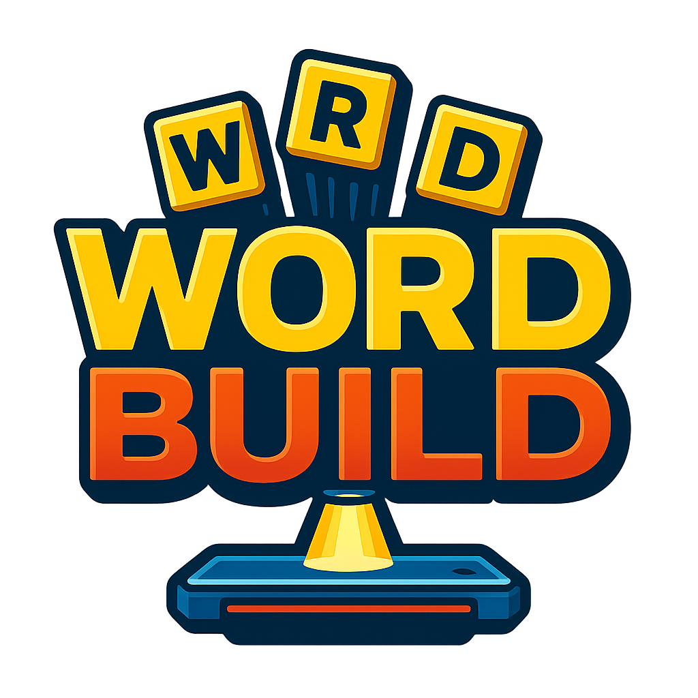

# Wordbuild

[](/Wordbuild_logo.png)

> An addictive word-building arcade game combining reflexes and vocabulary

## 🎮 Game Concept

Wordbuild is a web-based arcade word game where players control a platform with a tractor beam to capture falling letters and build words. Players must think quickly to grab the right letters as they fall at increasing speeds, placing them in the correct positions to complete words.

The core mechanics blend:
- **Arcade Action**: Control your platform and time your letter captures
- **Word Puzzles**: Form words by capturing the right letters
- **Increasing Challenge**: Face progressively longer words and faster letter drops

## ⚡ Current Status: Phase 1 Development (MVP)

This project is currently in Phase 1 development, focusing on creating a Minimum Viable Product (MVP) that demonstrates the core gameplay mechanics. We are implementing the essential features needed to validate the game concept.

### MVP Goals
- Implement core platform movement and tractor beam mechanics
- Create the falling letter system with proper physics
- Develop word completion and validation
- Build a basic progression system with increasing difficulty
- Create simple, functional UI elements
- Deploy a playable web version

## 🛠️ Tech Stack

- **Game Engine**: [Phaser 3](https://phaser.io/phaser3)
- **Languages**: HTML5, CSS3, JavaScript (ES6+)
- **Build System**: Webpack
- **Version Control**: Git/GitHub
- **Deployment**: GitHub Pages

## 🚀 Getting Started

### Prerequisites
- Node.js (v14+)
- npm or yarn

### Installation

1. Clone the repository
```bash
git clone https://github.com/your-username/wordbuild.git
cd wordbuild
```

2. Install dependencies
```bash
npm install
# or
yarn
```

3. Start the development server
```bash
npm start
# or
yarn start
```

4. Open your browser and navigate to `http://localhost:8080`

## 📂 Project Structure

```
wordbuild/
├── src/                  # Source files
│   ├── assets/           # Game assets (images, audio)
│   ├── scenes/           # Phaser scene files
│   ├── objects/          # Game object classes
│   ├── utils/            # Utility functions
│   ├── data/             # Game data (word lists, levels)
│   ├── index.html        # HTML template
│   └── index.js          # Main entry point
├── dist/                 # Built files (generated)
├── webpack/              # Webpack configuration
├── docs/                 # Documentation
└── package.json          # Project dependencies
```

## 🎯 Development Roadmap

### Phase 1: MVP (Current)
- Core gameplay mechanics
- Basic UI
- 20 levels with progressive difficulty
- Local storage for high scores
- Basic responsive design

### Future Plans
- Enhanced visuals and animations
- Multiple game modes
- Power-ups and special items
- Expanded word database
- User accounts and global leaderboards
- Mobile app version

## 🧪 Testing

Run tests with:
```bash
npm test
# or
yarn test
```

## 🤝 Contributing

We welcome contributions to Wordbuild! This project is in early development, so there are many ways to help:

1. Report bugs and request features by creating issues
2. Submit pull requests for bug fixes or new features
3. Improve documentation
4. Suggest words for the game database

Please read [CONTRIBUTING.md](docs/CONTRIBUTING.md) for details on our code of conduct and submission process.

## 🎮 Controls

### Desktop
- **Left/Right Arrow Keys**: Move platform
- **Spacebar**: Activate tractor beam
- **Esc**: Pause game

### Mobile
- **Touch and Drag**: Move platform
- **Tap Platform**: Activate tractor beam
- **Double Tap**: Pause game

## 📝 License

This project is licensed under the MIT License - see the [LICENSE](LICENSE) file for details.

## 🙏 Acknowledgments

- Word list sourced from [open-source dictionary]
- Inspired by classic arcade games and word puzzles
- Special thanks to the Phaser community for their excellent documentation

---

## 📊 Development Progress

- [x] Project setup and repository creation
- [x] Basic documentation
- [ ] Core game mechanics implementation
- [ ] User interface development
- [ ] Level design
- [ ] Initial testing
- [ ] MVP deployment

---

*Wordbuild is currently in active development. Check back soon for updates!*
